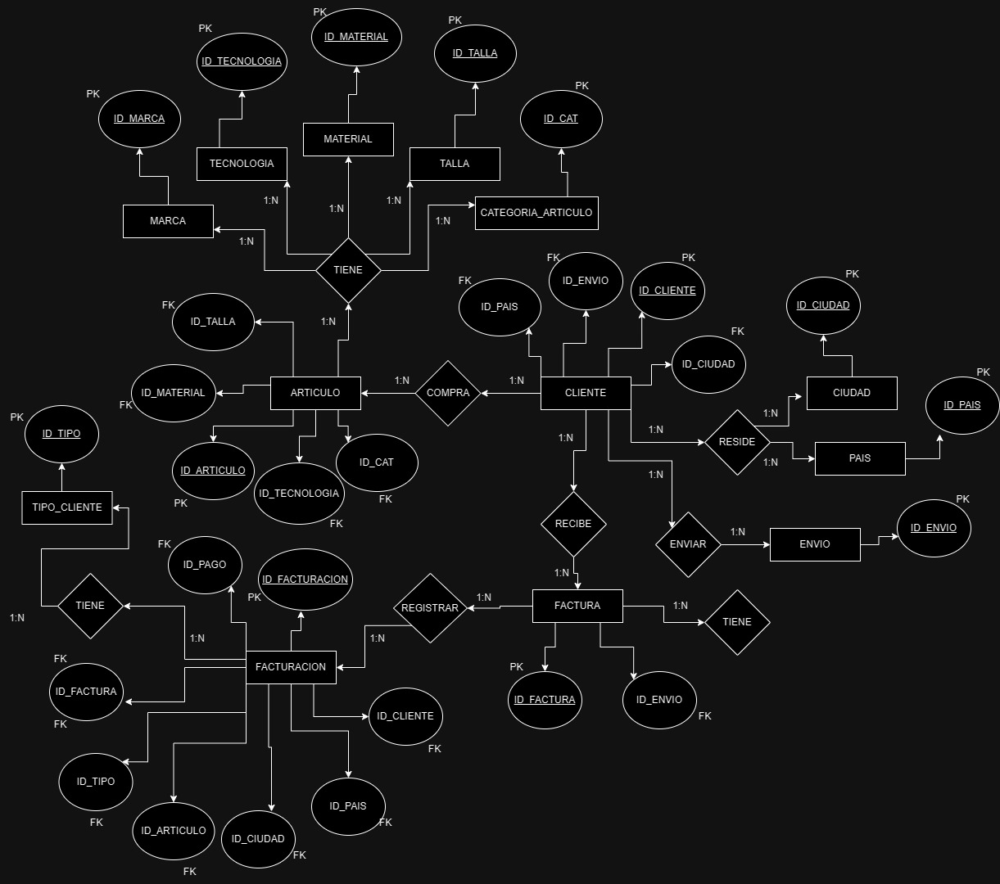
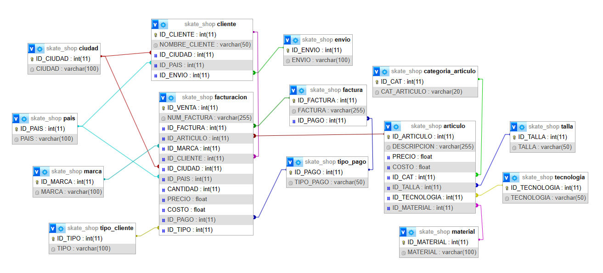
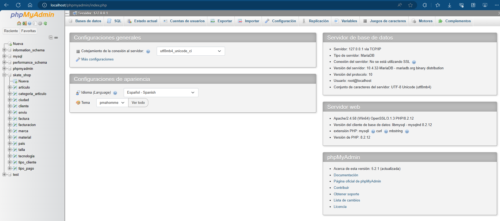
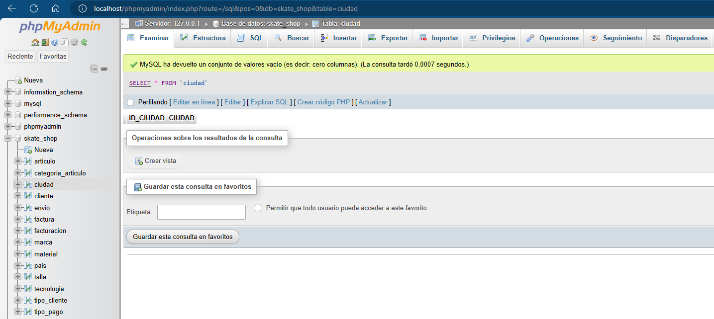
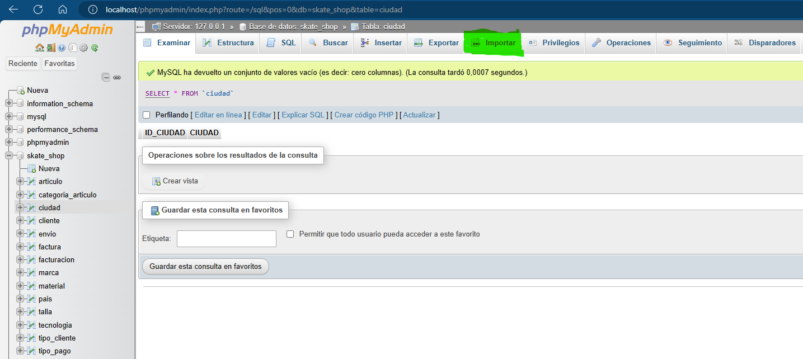
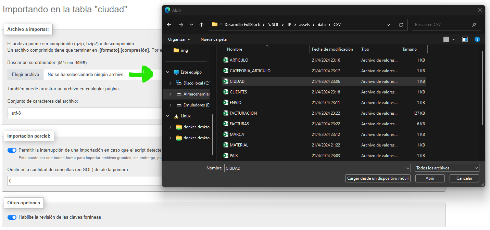
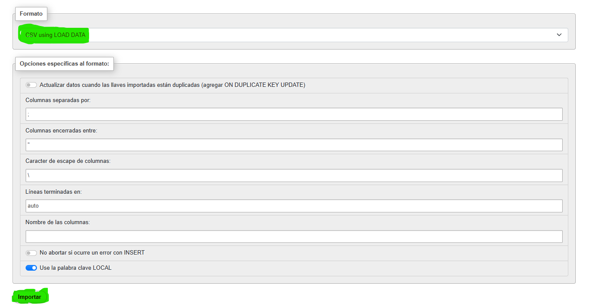

# _***Sistema de ventas de un SkateShop***_

## _***1. DESCRIPCION DEL SISTEMA DE VENTAS***_

En esta sección se describe el funcionamiento de las ventas en un SkateShop para asi entender como es el flujo de los datos de las ventas y de los balances generales contables de la empresa, el skateshop tiene sucursales en 5 países de su region y distribuye sus productos en 21 ciudades dentro de estos países, Este se encarga de distribuir patinetas de diferentes marcas, modelos, tallas y tecnologías que se ajustan a las características de cada consumidor, para esto requerimos diseñar una base de datos donde podamos almacenar toda esta informacion y asi tener un mayor entendimiento de como funciona la parte de ventas del skateshop.

La empresa tiene 3 tipos de clientes potenciales. Franquicias de SkateShops, SkateShops Grandes, SkateShops Pequeños a los cuales se distribuyen los productos que ordenan.

La empresa a su vez ofrece a dichos clientes varios métodos de pago a la hora de adquirir sus productos entre ellos podemos encontrar:
Efectivo, Crédito, Debito, Cheques.

Una vez el comprador decide hacer el pago del pedido al skateShop, este genera una factura de compra donde se guardaran todos los datos de los productos adquiridos por el cliente, La factura será entregada al comprador de forma física y a su vez esta factura será almacenada en la base de datos para tener un registro de todas las ventas realizadas a lo largo de tiempo.

Cuando finaliza el proceso de facturación el comprador elige la empresa de envíos de preferencia asociada con la distribuidora de patinetas:
DHL, FedEx, UPS, Schenker, TNT.

Cada uno de los productos ofrecidos por el skateShop tienen diferentes caracteriscticas que se adaptan a cada persona en particular:
Material, Tecnologia, Marca, Talla.

Cada uno de los productos ofrecidos por el skateShop tiene varias categorias dependiendo de sus caracteristicas:
Alta, media, baja.

La base de datos del skateshop nos debe permitir almacenar todos estos datos generados en las ventas para asi gestionar el flujo de los mismos de acuerdo a la facturacion obtenida por cada uno de los articulos que ofrece la empresa, esto es fundamental para ver como es el comportamiento de las ventas a lo lardo del tiempo

## 2. _***ENTIDADES Y ACTORES***_

### _***2.1. MATERIAL***_

La entidad _***MATERIAL***_ Contiene la información del material con el que estan fabricadas las patinetas que se distribuyen por el skateShop, esta entidad contiene los siguientes atributos

+ _***ID_material***_
+ _***Material***_

_***2.2. TECNOLOGIA***_

La entidad _***TECNOLOGIA***_ Contiene la informacion de las tecnologias con las que estan fabricadas las patinetas que se ofrecen el skateShop, esta entidad contiene los siguientes atributos

+ _***ID_Tecnologia***_
+ _***Tecnologia***_

### _***2.3. TALLA***_

La entidad _***TALLA***_ Contiene la informacion de todas las tallas disponibles en los articulos ofrecidos por la empresa, esta entidad contiene los sigueintes atributos

+ _***ID_Talla***_
+ _***Talla***_

### _***2.4. MARCA***_

La entidad _***MARCA***_ Contiene la informacion de todas las marcas que ofrece la empresa a sus clientes, esta entidad contiene los siguientes atributos

+ _***ID_Marca***_
+ _***Marca***_

### _***2.5. ENVIO***_

La entidad _***ENVIO***_ Contiene la informacion de las empresas por medio las cuales el skateShop realiza los envios de los productos a sus compradores, esta entidad contiene los siguientes atributos

+ _***ID_Envio***_
+ _***Envio***_

### _***2.6. CIUDAD***_

La entidad _***CIUDAD***_ Contiene la informacion de las ciudades donde se localizan los clientes del skateShop, esta entidad contiene los siguientes atributos

+ _***ID_Ciudad***_
+ _***Ciudad***_

### _***2.7. PAIS***_

La entidad _***PAIS***_ Contiene la informacion de los paises donde se encuentran los clientes de la empresa, esta entidad contiene los siguientes atributos

+ _***ID_Pais***_
+ _***Pais***_

### _***2.8. TIPO_DE_CLIENTE***_

La entidad _***TIPO_DE_CLIENTE***_ Contiene la informacion sobre el tipo de clientes que tiene la empresa, esta entidad contiene los siguientes atributos

+ _***ID_Tipo***_
+ _***Descripcion***_

### _***2.9. CATEGORIA_ARTICULO***_

La entidad _***CATEGORIA_ARTICULO***_ Contiene toda la información de la gamma de los productos vendidos en la empresa, esta entidad contiene los siguientes atributos

+ _***ID_Cat***_
+ _***Cat_Articulo***_

### _***2.10. TIPO_PAGO***_

La entidad _***TIPO_PAGO***_ Contiene toda la informacion sobre los metodos de pago que los clientes de la empresa pueden elegir para adquirir los articulos ofrecidos por la empresa, este entidad contiene los siguientes atributos

+ _***ID_Pago***_
+ _***Tipo_pago***_

### _***2.11. CLIENTE***_

La entidad _***CLIENTE***_ Contiene toda la información de los clientes que compran los productos de la empresa, para asi poder hacer el envio correspondiente, esta entidad contiene los siguientes atributos

+ _***ID_Cliente***_
+ _***ID_Envio***_
+ _***ID_Pais***_
+ _***ID_Ciudad***_
+ _***Nombre_Cliente***_

### _***2.12. ARTICULO***_

Contiene toda la información de los productos que ofrece la distribuidora de patinetas a sus clientes, Esta entidad contiene los siguientes atributos

+ _***ID_Articulo***_
+ _***ID_Cat***_
+ _***ID_talla***_
+ _***ID_Tecnologia***_
+ _***ID_Material***_
+ _***Costo***_
+ _***Precio***_
+ _***Descripcion***_

### _***2.13. FACTURA***_

La entidad _***FACTURA***_ Contiene la información que se registrara en la base de datos acerca de las ventas realizadas, esta entidad contiene los siguientes atributos

+ _***ID_Factura***_
+ _***ID_pago***_
+ _***Factura***_

### _***2.14. FACTURACION***_

La entidad _***FACTURACION***_ Se comporta como la tabla de hechos de nuestro sistema y contiene toda la informacion sobre las ventas que se han generado en el ciclo de vida del skateShop, esta entidad contiene los siguientes atributos

+ _***ID_Facturacion***_
+ _***ID_Factura***_
+ _***ID_Articulo***_
+ _***ID_Marca***_
+ _***ID_Cliente***_
+ _***ID_Pais***_
+ _***ID_Ciudad***_
+ _***ID_Tipo***_
+ _***ID_Pago***_
+ _***Num_Factura***_
+ _***Cantidad***_
+ _***Precio***_
+ _***Costo***_

## _***3. DIAGRAMA ENTIDAD RELACION***_

En el siguiente diagrama Entidad-Relacion se puede observar como las entidades de la base de datos del skateshop se relacionan entre si, y ademas se puede observar que tipo de relaciones tiene entre ellas para poder analizar de una mejor manera como es el comportamiento de los datos.

## _***4. TABLAS USADAS EN LA BASE DE DATOS PARA EL SISTEMA DE FACTURACION***_

### _***4.1. MATERIAL:***_

+ Contiene la información del material con el que estan fabricadas las patinetas que se distribuyen por el skateShop, esta tabla se relaciona con la tabla _***ARTICULO***_

_***CAMPO***_         | _***TIPO DE DATO***_ | _***TIPO DE CLAVE***_
----------------------|----------------------|----------------------
 _***ID_MATERIAL***_  |        INT           |         PK
 _***MATERIAL***_     |      VARCHAR         |         -

### _***4.2. TECNOLOGIA:***_

+ Contiene la informacion de las tecnologias con las que estan fabricadas las patinetas que se ofrecen el skateShop, esta tabla se relaciona con la tabla _***ARTICULO***_

_***CAMPO***_          | _***TIPO DE DATO***_ | _***TIPO DE CLAVE***_
-----------------------|---------------------|----------------------
 _***ID_TECNOLOGIA***_ |        INT          |         PK
  _***TECNOLOGIA***_   |      VARCHAR        |         -

### _***4.3. TALLA:***_

+ Contiene la informacion de todas las tallas disponibles en los articulos ofrecidos por la empresa, esta tabla se relaciona con la tabla _***ARTICULO***_

_***CAMPO***_         | _***TIPO DE DATO***_ | _***TIPO DE CLAVE***_
----------------------|----------------------|----------------------
 _***ID_TALLA***_     |        INT           |         PK
  _***TALLA***_       |      VARCHAR         |         -

### _***4.4. MARCA:***_

+ Contiene la informacion de todas las marcas que ofrece la empresa a sus clientes, esta tabla se relaciona con la tabla _***ARTICULO***_

_***CAMPO***_         | _***TIPO DE DATO***_ | _***TIPO DE CLAVE***_
----------------------|----------------------|----------------------
 _***ID_MARCA***_     |        INT           |         PK
  _***MARCA***_       |      VARCHAR         |         -

### _***4.5. ENVIO:***_

+ Contiene la informacion de las empresas por medio las cuales el skateShop realiza los envios de los productos a sus compradores, Esta tabla se relaciona con la tabla _***CLIENTE***_

_***CAMPO***_         | _***TIPO DE DATO***_ | _***TIPO DE CLAVE***_
----------------------|----------------------|----------------------
 _***ID_ENVIO***_     |         INT          |         PK
  _***ENVIO***_       |       VARCHAR        |         -

### _***4.6. CIUDAD:***_

+ Contiene la informacion de las ciudades donde se localizan los clientes del skateShop, esta tabla se relaciona con las tablas _***CLIENTE & Facturacion***_

_***CAMPO***_         | _***TIPO DE DATO***_ | _***TIPO DE CLAVE***_
----------------------|----------------------|----------------------
 _***ID_CIUDAD***_    |         INT          |         PK
   _***CIUDAD***_     |       VARCHAR        |         -

### _***4.7. PAIS:***_

+ Contiene la informacion de los paises donde se encuentran los clientes de la empresa, esta tabla se relaciona con las tablas _***CLIENTE & FACTURACION***_

_***CAMPO***_         | _***TIPO DE DATO***_ | _***TIPO DE CLAVE***_
----------------------|----------------------|----------------------
 _***ID_PAIS***_      |         INT          |         PK
   _***PAIS***_       |       VARCHAR        |         -

### _***4.8. TIPO_CLIENTE:***_

+ Contiene la informacion sobre el tipo de clientes que tiene la empresa, esta tabla se relaciona con la tabla _***FACTURACION***_

_***CAMPO***_              | _***TIPO DE DATO***_ | _***TIPO DE CLAVE***_
---------------------------|----------------------|----------------------
 _***ID_TIPO***_           |         INT          |         PK
   _***DESCRIPCION***_     |       VARCHAR        |         -

### _***4.9. CATEGORIA_ARTICULO:***_

+ Contiene toda la información de la gamma de los productos vendidos en la empresa, esta tabla se relaciona con la tabla _***ARTICULO***_

_***CAMPO***_               | _***TIPO DE DATO***_ | _***TIPO DE CLAVE***_
----------------------------|----------------------|----------------------
 _***ID_CAT***_             |         INT          |         PK
   _***CAT_ARTICULO***_     |       VARCHAR        |         -

### _***4.10. TIPO_PAGO:***_

+ Contiene toda la informacion sobre los metodos de pago que los clientes de la empresa pueden elegir para adquirir los articulos ofrecidos por la empresa, esta tabla se relaciona con las tablas _***FACTURA & FACTURACION***_

_***CAMPO***_            | _***TIPO DE DATO***_ | _***TIPO DE CLAVE***_
-------------------------|----------------------|----------------------
 _***ID_PAGO***_         |         INT          |         PK
   _***TIPO_PAGO***_     |       VARCHAR        |         -

### _***4.11. CLIENTE:***_

+ Contiene toda la información de los clientes que compran los productos de la empresa, esta tabla se relaciona con la tabla _***FACTURACION***_

_***CAMPO***_                  | _***TIPO DE DATO***_ | _***TIPO DE CLAVE***_
-------------------------------|----------------------|----------------------
 _***ID_CLIENTE***_            |         INT          |         PK
   _***ID_ENVIO***_            |         INT          |         FK
   _***ID_PAIS***_             |         INT          |         FK
_***ID_CIUDAD***_              |         INT          |         FK
   _***NOMBRE_CLIENTE***_      |         VARCHAR      |         -

### _***4.12. ARTICULO:***_

+ Contiene toda la información de los productos que ofrece la distribuidora de patinetas a sus clientes, esta tabla se relaciona con la tabla _***FACTURACION***_

_***CAMPO***_                  | _***TIPO DE DATO***_ | _***TIPO DE CLAVE***_
-------------------------------|----------------------|----------------------
 _***ID_ARTICULO***_           |         INT          |         PK
   _***ID_CAT***_              |         INT          |         FK
   _***ID_TALLA***_            |         INT          |         FK
_***ID_TECNOLOGIA***_          |         INT          |         FK
_***ID_MATERIAL***_            |         INT          |         FK
   _***COSTO***_               |         VARCHAR      |         -
   _***PRECIO***_              |         VARCHAR      |         -
   _***DESCRIPCION***_         |         VARCHAR      |         -

### _***4.13. FACTURA:***_

+ Contiene toda la informacion sobre los articulos que se venden en el skateShop, esta tabla se relaciona con la tabla _***FACTURACION***_

_***CAMPO***_                  | _***TIPO DE DATO***_ | _***TIPO DE CLAVE***_
-------------------------------|----------------------|----------------------
 _***ID_FACTURA***_            |         INT          |         PK
   _***ID_PAGO***_             |         INT          |         FK
   _***FACTURA***_             |         VARCHAR      |         -

### _***4.14. FACTURACION:***_

+ Se comporta como la tabla de hechos de nuestro sistema y contiene toda la informacion sobre las ventas que se han generado en el ciclo de vida del skateShop

_***CAMPO***_                  | _***TIPO DE DATO***_ | _***TIPO DE CLAVE***_
-------------------------------|----------------------|----------------------
 _***ID_FACTURACION***_        |         INT          |         PK
 _***ID_FACTURA***_            |         INT          |         FK
 _***ID_ARTICULO***_           |         INT          |         FK
   _***ID_MARCA***_            |         INT          |         FK
   _***ID_CLIENTE***_          |         INT          |         FK
_***ID_PAIS***_                |         INT          |         FK
_***ID_CIUDAD***_              |         INT          |         FK
_***ID_TIPO***_                |         INT          |         FK
_***ID_PAGO***_                |         INT          |         FK
   _***NUM_FACTURA***_         |         VARCHAR      |         -
   _***CANTIDAD***_            |         INT          |         -
   _***PRECIO***_              |         FLOAT        |         -
   _***COSTO***_               |         FLOAT        |         -

### _***4.15. ACCIONES_TIPO_PAGO***_

+ Esta tabla almacena la informacion que proporciona el disparador _***CREATE_TIPO_PAGO***_ cuando se crea u nuevo tipo de pago en la empresa almacenando la fecha de creacion y los items que que contiene.

_***CAMPO***_                  | _***TIPO DE DATO***_ | _***TIPO DE CLAVE***_
-------------------------------|----------------------|----------------------
_***ID***_                     |INT                   |PK
ACCION                         |VARCHAR               |-
FECHA                          | DATETIME             |-

### _***4.16. ACCIONES_TIPO_CLIENTE***_

+ Esta tabla almacena la informacion que proporciona el disparador _***CREATE_TIPO_CLIENTE***_ cuando se crea un nuevo tipo de cliente en la empresa almacenando la fecha de creacion y los items que contiene.

_***CAMPO***_                  | _***TIPO DE DATO***_ | _***TIPO DE CLAVE***_
-------------------------------|----------------------|----------------------
_***ID***_                     |INT                   |PK
ACCION                         |VARCHAR               |-
FECHA                          | DATETIME             |-

## 5. MODELO RELACIONAL

## 6. IMPORTACION DE DATOS

los datos almacenados en las tablas de la base de datos se obtuvieron desde varios archivos _***.csv***_, para importar estos datos usamos el asistente virtual de _***PhpMyAdmin***_ para acceder a este asistente e importar los datos se hace lo siguiente:

### _***Paso 1***_

+ entrar al asistente _***PhpMyAdmin***_

para acceder al asiste _***PhpMyAdmin***_ se abre el panel de control de Xampp para activar los servicios de _***Apache***_ y _***MySql***_.
Una vez activos ambos servicios presionamos el boton admin situado enseguida del boton que inicia los servicos de MySql para abrir el asistente _***PhpMyAdmin***_ en el navegador.

### _***Paso 2***_

+ Seleccionar la tabla en la cual se van a importar los datos.

El asistente de base de datos _***PhpMyAdmin***_ funciona de forma similar a MySql workbench, en la barra lateral izquierda aparecen todas las bases de datos creadas.

+ Seleccionamos la base de datos del SkateShop y posteriormente la tabla a la cual queremos importar los datos, en este caso se eligio la tabla _***CIUDAD***_.
+ Una vez seleccionada la tabla en la barra superior se presiona el boton import.

### _***Paso 3***_

+ Se carga el archivo _***.csv***_

+ Dentro de la pestaña _***import***_ aparecen varias opciones, primeramente se selecciona la opcion de elegir archivo y nos abrira el explorador de archivos y alli se selecciona el archivo _***.csv***_ que contiene los datos que se requieren cargar en la tabla y seleccionamos la opcion utf-8 para que sirvan los caracteres especiales del teclado.
+ Luego en la opcion formato se le asigna la opcion _***CSV using LOAD_DATA***_ para que separe las columanas con ; y no con , y se puedan cargan los datos correctamente.
+ Por ultimo se presiona el boton importar y se cargan los datos.

### Este proceso se repite para cada uno de los _***DataSets***_ que contienen los datos que se requieren para cargar dentro de las demas tablas de la base de datos

## 7. _***VISTAS***_

### 7.1 _***ARTICULO_MAS_VENDIDO***_

Esta vista muestra en una tabla generada con consultas cual fue el producto con el mayor numero de ventas, para hacer la vista se hace un _***SELECT***_ de la tabla _***ARTICULO***_ solicitando el nombre del articulo y la cantidad de ventas que este obtuvo, a esta consulta se le asigna el alias _***AR***_. Como paso siguiente se hace un _***RIGHT JOIN***_ con la tabla _***FACTURACION***_ a esta se le asigna el alias _***FACT***_ y este _***RIGHT JOIN***_ con su condicion _***ON***_ valida que su _***ID_ARTICULO***_ de la tabla _***FACTURACION***_ se igual al _***ID_ARTICULO***_ de la tabla _***ARTICULO***_, cuando el sistema hace dicha validacion se hace un _***GROUP BY***_ por el campo _***ARTICULO***_ para agrupar este campo y todos sus valores, por ultimo se hace un _***ORDER BY***_ de forma descendente para ver en el primer registro el producto mas vendido en el SkateShop.

### 7.2 _***ARTICULO_MENOS_VENDIDO***_

Esta vista muestra en una tabla generada con consultas cual fue el producto con el menor numero de ventas, para hacer la vista se hace un _***SELECT***_ de la tabla _***ARTICULO***_ solicitando el nombre del articulo y la cantidad de ventas que este obtuvo, a esta consulta se le asigna el alias _***AR***_. Como paso siguiente se hace un _***RIGHT JOIN***_ con la tabla _***FACTURACION***_a esta se le asigna el alias _***FACT***_ y este _***RIGHT JOIN***_ con su condicion _***ON***_ valida que su _***ID_ARTICULO***_ de la tabla _***FACTURACION***_ se igual al _***ID_ARTICULO***_ de la tabla _***ARTICULO***_, cuando el sistema hace dicha validacion se hace un _***GROUP BY***_ por el campo _***ARTICULO***_ para agrupar este campo y todos sus valores, por ultimo se hace un _***ORDER BY***_ de forma ascedente para ver en el primer registro el producto menos vendido en el SkateShop.

### 7.3 _***CIUDAD_MAS_COMPRAS***_

Esta vista muestra en una tabla generada con consultas cual fue la ciudad con el mayor numero de compras, para hacer la vista se hace un _***SELECT***_ de la tabla _***CIUDAD***_ solicitando el nombre de la ciudad y la cantidad de compras que esta realizo, a esta consulta se le asigna el alias _***CI***_. Como paso siguiente se hace un _***RIGHT JOIN***_ con la tabla _***FACTURACION***_ a esta se le asigna el alias _***FACT***_ y este _***RIGHT JOIN***_ con su condicion _***ON***_ valida que su _***ID_CIUDAD***_ de la tabla _***FACTURACION***_ se igual al _***ID_CIUDAD***_ de la tabla _***CIUDAD***_, cuando el sistema hace dicha validacion se hace un _***GROUP BY***_ por el campo _***CIUDAD***_ para agrupar este campo y todos sus valores, por ultimo se hace un _***ORDER BY***_ de forma descedente para ver en el primer registro la ciudad con mas compras generadas SkateShop.

### 7.4 _***CIUDAD_MENOS_COMPRAS***_

Esta vista muestra en una tabla generada con consultas cual fue la ciudad con el menor numero de compras, para hacer la vista se hace un _***SELECT***_ de la tabla _***CIUDAD***_ solicitando el nombre de la ciudad y la cantidad de compras que esta realizo, a esta consulta se le asigna el alias _***CI***_. Como paso siguiente se hace un _***RIGHT JOIN***_ con la tabla _***FACTURACION***_ a esta se le asigna el alias _***FACT***_ y este _***RIGHT JOIN***_ con su condicion _***ON***_ valida que su _***ID_CIUDAD***_ de la tabla _***FACTURACION***_ se igual al _***ID_CIUDAD***_ de la tabla _***CIUDAD***_, cuando el sistema hace dicha validacion se hace un _***GROUP BY***_ por el campo _***CIUDAD***_ para agrupar este campo y todos sus valores, por ultimo se hace un _***ORDER BY***_ de forma ascedente para ver en el primer registro la ciudad con menos compras generadas SkateShop.

### 7.5 _***CLIENTE_MAS_COMPRAS***_

Esta vista muestra en una tabla generada con consultas cual fue el cliente con el mayor numero de compras, para hacer la vista se hace un _***SELECT***_ de la tabla _***CLIENTE***_ solicitando el nombre del cliente y la cantidad de compras que esta realizo, a esta consulta se le asigna el alias _***CLI***_. Como paso siguiente se hace un _***RIGHT JOIN***_ con la tabla _***FACTURACION***_ a esta se le asigna el alias _***FACT***_ y este _***RIGHT JOIN***_ con su condicion _***ON***_ valida que el _***ID_CLIENTE***_ de la tabla _***FACTURACION***_ se igual al _***ID_CLIENTE***_ de la tabla _***CLIENTE***_, cuando el sistema hace dicha validacion se hace un _***GROUP BY***_ por el campo _***CLIENTE***_ para agrupar este campo y todos sus valores, por ultimo se hace un _***ORDER BY***_ de forma descedente para ver en el primer registro del cliente con mas compras generadas SkateShop.

### 7.6 _***CLIENTE_MENOS_COMPRAS***_

Esta vista muestra en una tabla generada con consultas cual fue el cliente con el mayor numero de compras, para hacer la vista se hace un _***SELECT***_ de la tabla _***CLIENTE***_ solicitando el nombre del cliente y la cantidad de compras que esta realizo, a esta consulta se le asigna el alias _***CLI***_. Como paso siguiente se hace un _***RIGHT JOIN***_ con la tabla _***FACTURACION***_ a esta se le asigna el alias _***FACT***_ y este _***RIGHT JOIN***_ con su condicion _***ON***_ valida que el _***ID_CLIENTE***_ de la tabla _***FACTURACION***_ se igual al _***ID_CLIENTE***_ de la tabla _***CLIENTE***_, cuando el sistema hace dicha validacion se hace un _***GROUP BY***_ por el campo _***CLIENTE***_ para agrupar este campo y todos sus valores, por ultimo se hace un _***ORDER BY***_ de forma asccedente para ver en el primer registro del cliente con mas compras generadas SkateShop.

## 8. _***PROCEDIMIENTOS ALMACENADOS***_

+ _***8.1***_ Los siguientes procesos almacenados sirven para hacer las operaciones basicas en una base de datos(CRUD) sobre la tabla de _***TIPO_PAGO***_ para crear, actualizar y eliminar los metodos de pago disponibles en la empresa

      CREAR_TIPO_PAGO: Este procedimiento almacenado contiene una sentencia de codigo que sirve para crear un nuevo metodo de pago que se adecue a las necesidades del cliente.

      OBTENER_TIPO_PAGO: Este procedimiento almacenado contiene una sentencia de codigo que sirve para obtener toda la informacion de la tabla TIPO_PAGO.

      ACTUALIZAR_TIPO_PAGO: Este procedimiento almacenado contiene una sentencia de codigo que sirve para actualizar los metodos de pago ya existentes en la base de datos de la empresa.

      BORRAR_TIPO_PAGO: Este procedimiento almacenado contiene una sentencia de codigo que sirve para borrar los metodos de pago que han sido creados.

+ _***8.2***_ Los siguientes procesos almacenados sirven para hacer las operaciones basicas en una base de datos(CRUD) sobre la tabla de _***TIPO_CLIENTE***_ para crear, actualizar y eliminar los metodos de pago disponibles en la empresa

      CREAR_TIPO_CLIENTE: Este procedimiento almacenado contiene una sentencia de codigo que permite crear un tipo de cliente.

      OBTENER_TIPO_CLIENTE: Este procedimiento almacenado contiene una sentencia de codigo que sirve para obtener toda la informacion de la tabla TIPO_CLIENTE.

      ACTUALIZAR_TIPO_CLIENTE: Este procedimiento almacenado contiene una sentencia de codigo que permite actualizar la informacion del tipo de cada cliente que haya sido creado con anterioridad.

      BORRAR_TIPO_CLIENTE: Este pocedimiento almacenado contiene una sentencia de codigo que permite borrar los tipos de clientes que han sido creados con anterioridad

## 9. _***FUNCIONES***_

+ _***INGRESOS_TOTALES:***_ Esta funcion sirve para hacer la suma total de las ventas y retornara los ingresos que ha tenido la empresa durante el tiempo.

+ _***MAYOR_VENTA:***_ Esta funcion sirve para saber cual fue la mejor venta que ha tenido la empresa, esta funcion retornara el valor de la mayor venta realizada.

+ _***MENOR_VENTA:***_ Esta funcion sirve para saber cual fue la peor venta que ha tenido la empresa, esta fncion retornara el valor de la peor venta realizada.

+ _***NUMERO_CLIENTES:***_ Esta funcion sirve para saber cuantos clientes tiene la empresa, esta funcion retorna un valor numerico con el dato de la cantidad de clientes.

+ _***NUMERO_VENTAS:***_ Esta funcion sirve para saber cuantas ventas se han realizado en la empresa en el transcurso del tiempo y retorno un valor numerico que nos dara el dato de el numero de ventas.

+ _***PROMEDIO_VENTAS:***_ Esta funcion sirve para promediar las ventas que ha realizado la empresa.

## 10. _***TRIGGERS***_

+ _***CREATE_TIPO_PAGO:***_ Este disparador se activa cuando se crea un nuevo metodo de pago dentro de la tabla _***TIPO_PAGO***_ mostrando la fecha de creacion del metodo de pago, su respectivo ID y el tipo de pago del registro, para hacer esto se debe crear una tabla nueva donde el diparador almacenara esta informacion esta tabla se llama _***ACCIONES_TIPO_PAGO***_.

+ _***CREATE_TIPO_CLIENTE:***_ Este disparador se activa cuando se crea un nuevo tipo de cliente dentro de la tabla _***TIPO_CLIENTE***_ mostrando la fecha de creacion del tipo de cliente, su respectivo ID y el tipo de cliente del registro, para hacer esto se debe crear una tabla nueva donde el diparador almacenara esta informacion esta tabla se llama _***ACCIONES_TIPO_CLIENTE***_.

### 11. _***USUARIOS Y ROLES***_

### 12. _***BACKUP***_

### 13. _***DOCKER***_

### 14. _***CARGA DEL PROYECTO EN GITHUB***_
